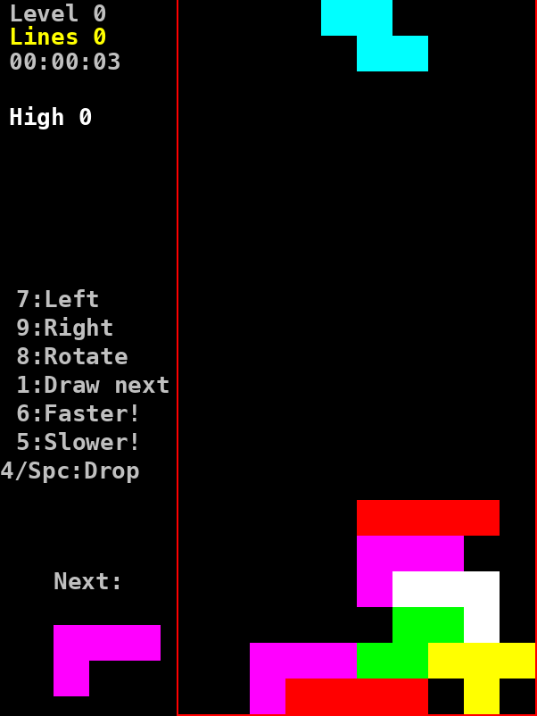

This is my JT (JavaTetris) game from 2002 (in that folder).

Will modernize it so it is runnable in browser again, most likely via JavaScript.

## Play it

**[▶ Play JT in your browser](https://mihailod.github.io/jt/)**

Arrow keys or `7` `8` `9` to move and rotate, `Space` to drop, `P` to pause.

The 2002 Java applet source is preserved untouched in [`2002/`](2002/).
